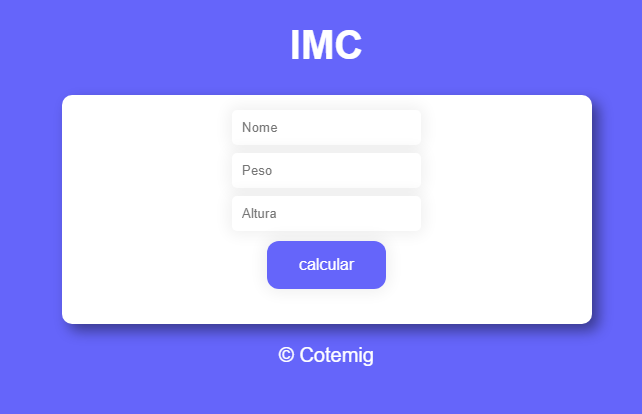
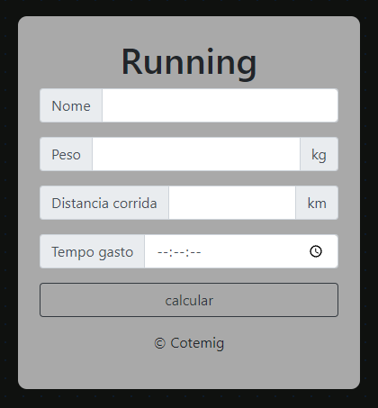

<h1>Projeto IMC</h1>
Neste projeto, a partir do nome, da idade e da altura do usuário, calcula-se o IMC e avalia-se em qual faixa de peso ele se encontra. A solução pode ser utilizada por médicos, nutricionistas e educadores físicos, por exemplo.

<h1>Projeto individual 1</h1>
Neste projeto, a partir do nome, peso, distancia percorrida e tempo gasto, calcula-se a velocidade média, pace e calorias gastas.

